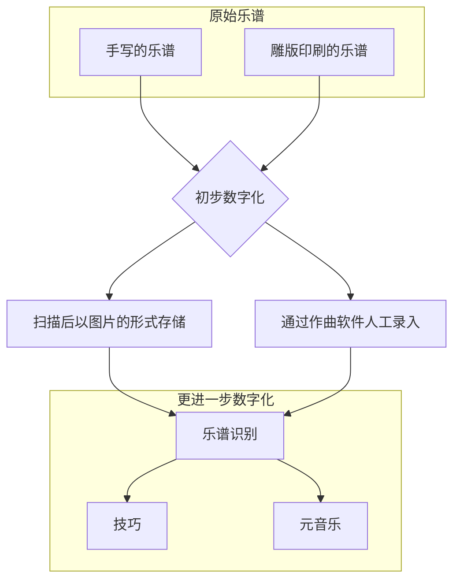
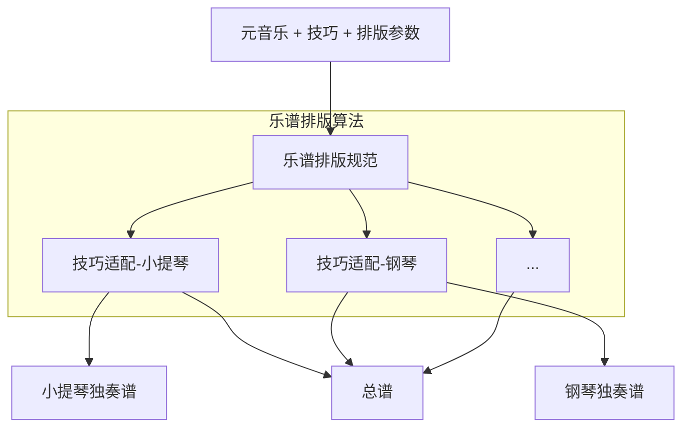

# 先进通用音乐符号系统(Advanced Common Music Notation System)

## 1.1 背景与动机
尽管目前Common Western Music Notation(简称CWMN)作为一种音乐表示方法已得到广泛应用，由于众多历史包袱，更高级别的数字化的进展并不顺利，现代谱曲软件与其他相关应用的发展也一直受到限制。

历史的包袱包括不限于乐谱规则的复杂程度。乐谱规则不但复杂，而且是动态发展的，直到十九世纪才基本稳定。
再加上缺乏CWMN严格的规范，使得多种音乐数据格式缺乏完整的“语法”层的信息（例如记录符号关于乐谱的绝对位置，这不能体现与其他符号的联系）。

乐谱的数字化的进程：



进一步数字化将乐谱分成[元音乐](./terms.md#primary-music)与[技巧](./terms.md#technique)两个部分，目的是便于在各个应用场景中灵活组装以实现不同的功能。

乐谱可重排版的功能可以实现乐谱展示时屏幕自适应，声部的分离展示与合并展示，甚至可以将特定乐器的乐谱自动转换为任意乐器的乐谱进行查看。
在辅助作曲的应用中，作曲家在作曲时只需关心音乐本身，根据规范自动推导出适应各种乐器的[技巧](./terms.md#technique)并生成乐谱。

典型的应用场景：


## 1.2 组成
ACMN主要包含乐谱排版规范和存储规范。

### 1.2.1 乐谱排版规范
考虑到在乐谱中使用不同的[music-font](./terms.md#music-font)，规范的内容不会涉及符号，页面的具体尺寸数值。并且只关注乐谱中音乐的部分，不对页面内容的排版如标题，作者做限制。
着重解决多个声部多个Beam重叠的排版问题，单个Staff多个声部重叠问题，符号优先级问题等等。
排版基本原则是排版后的结果可以无歧义地逆向还原为音乐编码，为此将不可避免牺牲一些兼容性。
```lilypond
        #(set-default-paper-size "a8")
        \paper {
            paper-height = 30
        }
        \header {
            tagline = ##f
        }
            
        \new Staff <<
            {c''2}
            \\
            {e'2}
            \\
            {c'8}
            \\
            {d'8}
            \\
            {<e'>8}
            \\
            {b''8}
            \\
            {g'8}
            \\
            {f'8}
            \\
            {a'''8}
        >>
```
（一个极端的例子，9个音符叠在第一拍上，lilypond的排版算法将可能重叠的元素错开。显然这有时是会带来歧义的。）

### 1.2.2 存储规范
包含[元音乐](./terms.md#primary-music)，[技巧](./terms.md#technique)和[排版参数](./terms.md#typesetting-params)。

## 1.3 与其他数字格式/音乐编码的对比
本规范并未包含具体音乐编码，假设存在一种音乐编码ACMN实现了本规范

|编码名称|与CWMN兼容性(估计)|可重排版|排版算法|排版结果与编码可互相转换|
|---|---|---|---|
|ACMN|较差|是|有|是|
|MusicXML|好|否|无|否|
|MNX|好|否|无|否|
|MEI|好|否|无|否|
|CMN|好|否|无|否|
|Lilypond|好|是|有，但无法避免可能产生的歧义|否|
|SMuFL|好|-|-|-|

补充：

lilypond有自己的排版算法，除了ACMN其他的格式的排版依赖于谱曲软件（不同的软件排版结果可能不一致）

与其他音乐编码不同，SMuFL定义了CWMN每个符号的编码与渲染方式，但它不包含音乐的上下文。
