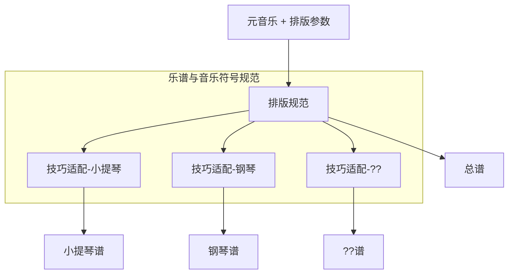

# 乐谱与音乐符号规范

```lilypond
        #(set-default-paper-size "a8")
        \paper {
            paper-height = 30
        }
        \header {
            tagline = ##f
        }
            
        \new Staff <<
            {c''2}
            \\
            {e'2}
            \\
            {c'8}
            \\
            {d'8}
            \\
            {<e'>8}
            \\
            {b''8}
            \\
            {g'8}
            \\
            {f'8}
            \\
            {a'''8}
        >>
```

## 背景与动机
随着现代谱曲软件的发展，代替传统的手写创作和雕版印刷发版方式已经成为趋势。
但由于众多历史包袱，现代谱曲软件与其他相关应用的发展也一直受到限制。
在描述具体问题之前先将使用乐谱的用户进行分类，不同的人群中对应着不同的乐谱展示需求。
* 作曲家
    * 转换为适应任意乐器的乐谱
    * 乐谱可重排版
        * 屏幕自适应
    * 辅助作曲
        * 检查乐谱是否可以被正确演奏
* 演奏者
    * 乐谱可重排版
* 观察者
    * 乐谱可重排版
* 开发者
    * 乐谱识别

本规范解决的问题是如何正确排版一张乐谱以及如何使乐谱的信息的整合与交换变得容易。
上面的需求可以通过"元音乐与技巧分离"与“乐谱排版”的技术得到解决。



### 乐谱排版
考虑到在乐谱中使用不同的[music-font](./terms.md#music-font)，规范的内容不会涉及符号，页面的具体数值。并且只关注乐谱中音乐的部分，不对页面内容的排版如标题，作者做限制。
例如如何解决多个声部多个Beam重叠的排版问题。
排版基本原则是排版后的结果可以无歧义地逆向还原为音乐编码，为此将不可避免牺牲一些兼容性。

### 元音乐与技巧分离
详见[元音乐](./terms.md#primary-music)与[技巧](./terms.md#technique)

## 与其他数字格式/音乐编码的关系
本规范并未包含具体音乐编码，假设存在一种音乐编码C实现了本规范

|编码名称|与常见乐谱兼容性|元音乐与技巧分离|可重排版|排版算法|
|---|---|---|---|
|C|40%|是|是|有|
|MusicXML|95%|否|否|无|
|MNX|95%|否|否|无|
|MEI|95%|否|否|无|
|Lilypond|95%|否|是|有，但无法避免可能产生的歧义|

补充：lilypond有自己的排版算法，其他的格式的排版依赖于谱曲软件（不同的软件排版结果可能不一致）

## 兼容性
### 与常见乐谱的兼容性
// TODO
### 不同乐器间转换乐谱的兼容性
// TODO

