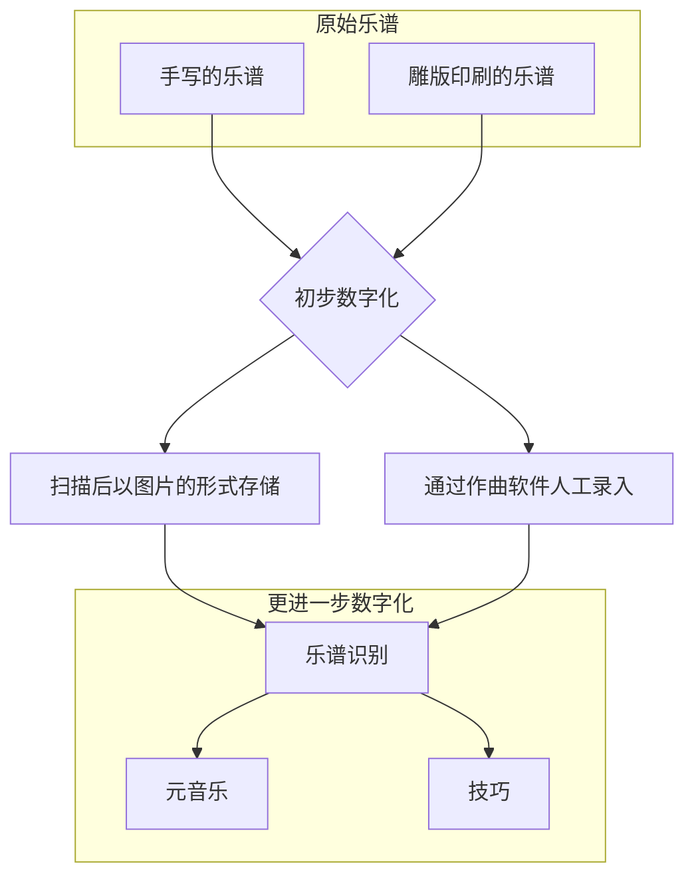
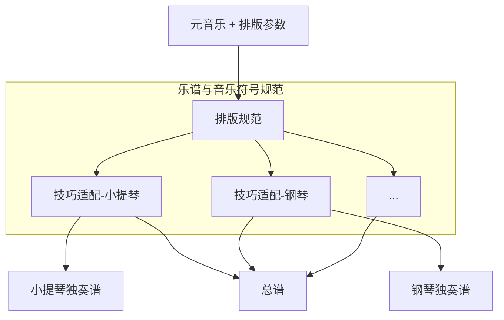

# 先进通用音乐符号系统(Advanced Common Music Notation)

## 背景与动机
基于Common Western Music Notation的现代谱曲软件代替传统的手写创作和雕版印刷发版方式已经成为趋势，
但由于众多历史包袱，数字化的进程并不顺利，现代谱曲软件与其他相关应用的发展也一直受到限制。

历史的包袱包括不限于乐谱规则的复杂程度。乐谱规则不但复杂，而且是动态发展的，直到十九世纪才基本稳定。
再加上现代乐谱规范的缺乏，使得多种音乐数据格式缺乏“语义”层的信息（例如记录符号关于乐谱的绝对位置，这不能体现与其他符号的联系）。所以即使通过作曲软件人工录入乐谱，仍然不算是真正的数字化。

乐谱的数字化的过程：



建立新的符号规范(以下简称ACMN)后再进一步数字化，将乐谱分成[元音乐](./terms.md#primary-music)与[技巧](./terms.md#technique)两个部分，目的是便于在各个应用场景中灵活组装以实现不同的功能。
可以解决各类人群中不同的乐谱展示需求。

* 作曲家
    * 乐谱可重排版
    * 辅助作曲
* 演奏者
    * 乐谱可重排版
* 观察者
    * 乐谱可重排版
* 开发者
    * 乐谱识别过程中统一的中间格式

其中乐谱可重排版的特性可以实现乐谱展示时屏幕自适应，声部的分离展示与合并展示，甚至可以将特定乐器的乐谱自动转换为任意乐器的乐谱进行查看。
辅助作曲，作曲家在作曲时只需关心音乐本身，根据规范自动推导出适应各种乐器的[技巧](./terms.md#technique)并生成乐谱，提高效率。

典型的应用场景：


ACMN包含四个方面，乐谱排版规范，技巧适配器规范，元音乐规范，排版参数规范。

### 乐谱排版
考虑到在乐谱中使用不同的[music-font](./terms.md#music-font)，规范的内容不会涉及符号，页面的具体尺寸数值。并且只关注乐谱中音乐的部分，不对页面内容的排版如标题，作者做限制。
着重解决多个声部多个Beam重叠的排版问题，单个Staff多个声部重叠问题，符号优先级问题等等。
排版基本原则是排版后的结果可以无歧义地逆向还原为音乐编码，为此将不可避免牺牲一些兼容性。
```lilypond
        #(set-default-paper-size "a8")
        \paper {
            paper-height = 30
        }
        \header {
            tagline = ##f
        }
            
        \new Staff <<
            {c''2}
            \\
            {e'2}
            \\
            {c'8}
            \\
            {d'8}
            \\
            {<e'>8}
            \\
            {b''8}
            \\
            {g'8}
            \\
            {f'8}
            \\
            {a'''8}
        >>
```
（一个极端的例子，9个音符叠在第一拍上，lilypond的排版算法将可能重叠的元素错开。显然这有时是会带来歧义的。）


### 技巧适配器规范
TODO

### 元音乐
[元音乐](./terms.md#primary-music)

### 排版参数
[排版参数](./terms.md#typesetting-params)

## 与其他数字格式/音乐编码的关系
本规范并未包含具体音乐编码，假设存在一种音乐编码X实现了本规范

|编码名称|与常见乐谱兼容性(估计)|元音乐与技巧分离|可重排版|排版算法|排版结果与编码可互相转换|
|---|---|---|---|
|X|较差|是|是|有|是|
|MusicXML|好|否|否|无|否|
|MNX|好|否|否|无|否|
|MEI|好|否|否|无|否|
|CMN|好|否|否|无|否|
|Lilypond|好|否|是|有，但无法避免可能产生的歧义|否|

补充：lilypond有自己的排版算法，除了X其他的格式的排版依赖于谱曲软件（不同的软件排版结果可能不一致）
