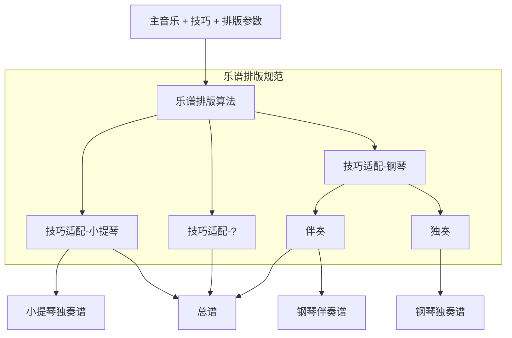

# 严格常规音乐符号系统(Strict Common Music Notation)

## 1.1 背景与动机

常见的五线谱采用的是一种不断演变约定俗成的符号规范(Coventional (Western) Music Notation 或 Common (Western) Music Notation 简称CMN或CWMN)，
主要功能是指导演奏者演奏和记录音乐，
而书面上的乐谱和实际演奏并不完全吻合，包含：

* 违反乐谱定义的，例如移调乐器的乐谱可能未标明移调信息
* 超出乐谱解释范围的，实际演奏中包含对乐谱的大量“推测”，如乐谱中未描述的细微的强弱变化以及揉弦的频率与方向，演奏时节奏上并不完全和理想中的节奏吻合等

很难说乐谱需要迎合实际演奏记录更多演奏细节和更精准的时值还是实际演奏需要迎合乐谱，除非这些“推测”已经成为共识，是可预测的行为。

不断演变的符号规范还带来了三个方面的历史包袱：

* CMN符号的含义，许多符号的含义在不同的时代，不同的作曲家有不同的解释，甚至有些符号本身就是含糊的（如渐强渐弱符号与强弱字母符号的叠加）
* CMN符号的值域，许多音符的属性的值域(例如最小时值)是未定义的，给乐谱的数字化带来不便
* CMN符号的排版规范，使用CMN可能无法精准地表示作曲家的音乐想法(产生歧义，或是因为符号重叠导致视觉上的读取困难)
也使得由CMN衍生出的多种音乐数子格式缺乏完整的“句法”层的信息（例如记录符号关于乐谱的绝对位置，不能体现与其他符号的联系）。
> CMN在多个方面的定义和边界是模糊的，具体情况和例子详见[CMNExtremesBody](http://homes.sice.indiana.edu/donbyrd/CMNExtremesBody.htm)和[InterestingMusicNotation](http://homes.sice.indiana.edu/donbyrd/InterestingMusicNotation.html)。

可见CMN作为记录音乐的方式并不具备良好的还原能力，在指导演奏者的角度上也有很多缺陷。
所以提出严格常规符号系统（Strict Common Music Notation，简称SCMN），不仅为了更精准地记录音乐，更为了实现更高级的数字化促进现代谱曲软件与其他相关应用的发展。

### 1.1.1 更高级的数字化

传统意义上的数字化，即由原始乐谱（手写的乐谱，雕版印刷的乐谱）通过扫描设备以数字图像的形式存储，或者通过作曲软件人工录入为传统的乐谱数字格式（musicXML等）。

进一步数字化将这些乐谱分成[主音乐](./terms.md#主音乐)(与声音相关的信息)
与[技巧](./terms.md#技巧)(与演奏技巧相关的信息)两个部分，将拥有完整的音乐上的“句法”层的信息，便于在各个应用场景中灵活组装以实现不同的功能。
乐谱将由这两个元素根据排版规范自动生成：

由此衍生的功能还有，乐谱展示时的屏幕自适应，声部的分离展示与合并展示，甚至可以将特定乐器的乐谱自动转换为任意乐器的乐谱进行查看。

完整的流程详见[这里](./application.md#score-generation)

## 1.2 SCMN的组成
* 排版规范
    * Score Layout
    * Staff Group
    * Staff
    * Bar
    * Measure
    * Clef
    * Note
* 存储规范
    * 排版参数
    * 主音乐
    * 技巧

### 1.2.1 乐谱排版规范
考虑到在乐谱中使用不同的[music-font](./terms.md#music-font)，规范的内容不会涉及符号与页面的具体尺寸数值。并且只关注乐谱中音乐的部分，不对页面内容的排版如标题，作者做限制。
着重解决如多个声部多个Beam重叠的排版问题，单个Staff多个声部重叠的排版问题，符号优先级问题等等。
排版基本原则是排版后的结果可以无歧义地逆向还原为音乐编码，为此将不可避免牺牲一些兼容性。

```lilypond
        #(set-default-paper-size "a8")
        \paper {
            paper-height = 30
        }
        \header {
            tagline = ##f
        }
            
        \new Staff <<
            {c''2}
            \\
            {e'2}
            \\
            {c'8}
            \\
            {d'8}
            \\
            {<e'>8}
            \\
            {b''8}
            \\
            {g'8}
            \\
            {f'8}
            \\
            {a'''8}
        >>
```
（一个极端的例子，9个音符叠在第一拍上，lilypond的排版算法将可能重叠的元素错开。显然这有时会带来歧义。）

### 1.2.2 存储规范
包含[主音乐](./terms.md#主音乐)，[技巧](./terms.md#技巧)和[排版参数](./terms.md#排版参数)。

## 1.3 与其他数字格式/音乐编码的对比

|编码名称|与CMN兼容性(估计)|排版算法|排版结果与编码可互相转换|
|---|---|---|---|
|SCMN|较差|有|是|
|MusicXML|好|无|否|
|MNX|好|无|否|
|MEI|好|无|否|
|Lilypond|好|有，但无法避免可能产生的歧义|否|
|SMuFL|好|-|-|

补充：

* lilypond有自己的排版算法，除了SCMN其他的格式的排版依赖于谱曲软件（不同的软件排版结果可能不一致），都无法避免产生可能的歧义。

* 与其他音乐编码不同，SMuFL定义了CMN每个符号的编码和部分符号组合的排版约定，但不包含音乐的上下文，只是一种音乐字体规范。

## 1.4 实现原则

设计每一条规范需要考虑多个方面的因素

* 关于CMN的兼容性
* 符号系统的可读性
* 符号系统的一致性（避免“一词多义”或“一义多词”）
* 排版算法的计算成本
* 符号的使用频率
* CMN到SCMN的转换成本（计算成本与人工成本，可能需要人工介入）
