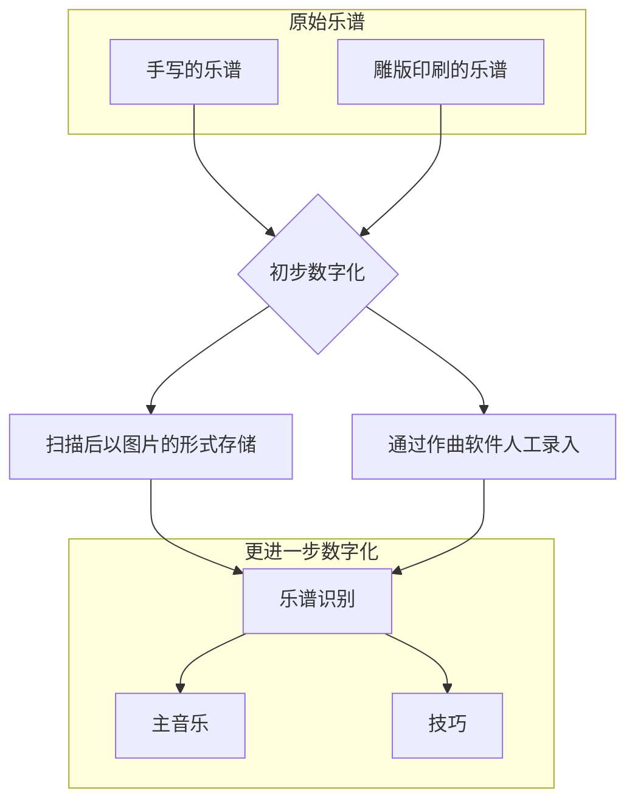

# 先进通用音乐符号系统(Advanced Common Music Notation System)

## 1.1 背景与动机
常见的五线谱采用的是一种不断演变约定俗成的符号规范(Coventional (Western) Music Notation, 简称CMN或CWMN)，
带来了三个方面的历史包袱
* CMN符号的含义，许多符号的含义在不同的时代，不同的作曲家有不同的解释，甚至有些符号本身就是含糊的;
* CMN符号的值域，许多音符的属性的值域(例如最小时值)是未定义的，给乐谱的数字化带来不便
* CMN符号的排版规范，使用CMN可能无法精准地表示作曲家的音乐想法(产生歧义，或是因为符号重叠导致视觉上的读取困难)
也使得由CMN衍生出的多种音乐数子格式缺乏完整的“句法”层的信息（例如记录符号关于乐谱的绝对位置，不能体现与其他符号的联系）。
> CMN在多个方面的定义和边界是模糊的，具体情况和例子详见[这里](http://homes.sice.indiana.edu/donbyrd/CMNExtremesBody.htm)和[这里](http://homes.sice.indiana.edu/donbyrd/InterestingMusicNotation.html)。

为了一致性和现代谱曲软件与其他相关应用的发展，需要基于CMN的乐谱的更高级的数字化。
理想中的乐谱数字化的过程：



进一步数字化将乐谱分成[主音乐](./terms.md#primary-music)(与声音相关的信息)
与[技巧](./terms.md#technique)(与演奏技巧相关的信息)两个部分，目的是便于在各个应用场景中灵活组装以实现不同的功能。

基于以上实现的乐谱可重排版的功能可以在乐谱展示时屏幕自适应，声部的分离展示与合并展示，甚至可以将特定乐器的乐谱自动转换为任意乐器的乐谱进行查看。
在辅助作曲的应用中，可将主要注意力放在音乐本身而不是复杂的符号系统，根据规范自动推导出适应各种乐器的[技巧](./terms.md#technique)并生成乐谱。

乐谱生成的应用场景：

完整的流程详见[这里](./application.md#score-generation)

## 1.2 组成
* 排版规范
    * Score Layout
    * Staff Group
    * Staff
    * Bar
    * Measure
    * Clef
    * Note
* 存储规范
    * 排版参数
    * 主音乐
    * 技巧

### 1.2.1 乐谱排版规范
考虑到在乐谱中使用不同的[music-font](./terms.md#music-font)，规范的内容不会涉及符号与页面的具体尺寸数值。并且只关注乐谱中音乐的部分，不对页面内容的排版如标题，作者做限制。
着重解决多个声部多个Beam重叠的排版问题，单个Staff多个声部重叠的排版问题，符号优先级问题等等。
排版基本原则是排版后的结果可以无歧义地逆向还原为音乐编码，为此将不可避免牺牲一些兼容性。
```lilypond
        #(set-default-paper-size "a8")
        \paper {
            paper-height = 30
        }
        \header {
            tagline = ##f
        }
            
        \new Staff <<
            {c''2}
            \\
            {e'2}
            \\
            {c'8}
            \\
            {d'8}
            \\
            {<e'>8}
            \\
            {b''8}
            \\
            {g'8}
            \\
            {f'8}
            \\
            {a'''8}
        >>
```
（一个极端的例子，9个音符叠在第一拍上，lilypond的排版算法将可能重叠的元素错开。显然这有时会带来歧义。）

### 1.2.2 存储规范
包含[主音乐](./terms.md#primary-music)，[技巧](./terms.md#technique)和[排版参数](./terms.md#typesetting-params)。

## 1.3 与其他数字格式/音乐编码的对比
本规范并未包含具体音乐编码，假设存在一种音乐编码ACMN实现了本规范

|编码名称|与CMN兼容性(估计)|可重排版|排版算法|排版结果与编码可互相转换|
|---|---|---|---|
|ACMN|较差|是|有|是|
|MusicXML|好|否|无|否|
|MNX|好|否|无|否|
|MEI|好|否|无|否|
|Lilypond|好|是|有，但无法避免可能产生的歧义|否|
|SMuFL|好|-|-|-|

补充：

lilypond有自己的排版算法，除了ACMN其他的格式的排版依赖于谱曲软件（不同的软件排版结果可能不一致）

与其他音乐编码不同，SMuFL定义了CMN每个符号的编码和部分符号组合的渲染约定，不包含音乐的上下文。
