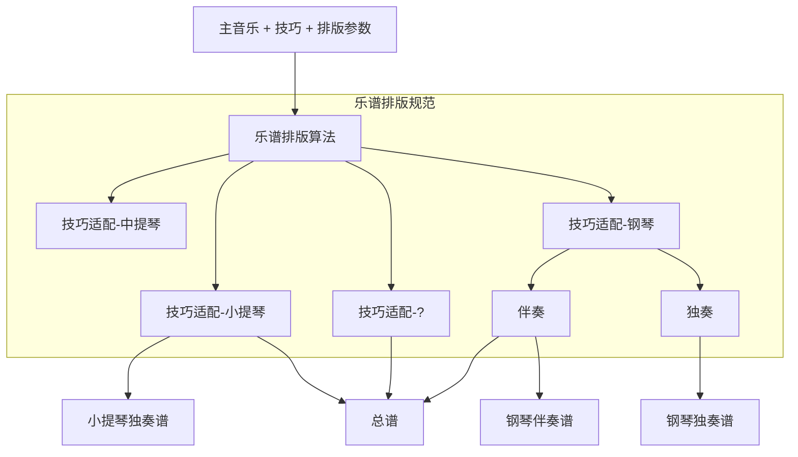

# 乐谱生成

```mermaid
graph TD;
  A[主音乐 + 技巧 + 排版参数]-->B[乐谱排版算法]
  subgraph 乐谱排版规范
  B-->C[技巧适配-小提琴]
  B-->V[技巧适配-中提琴]
  B-->D[技巧适配-钢琴]
  D-->D2[伴奏]
  D-->D1[独奏]
  B-->X[技巧适配-?]
  end
  C-->G[小提琴独奏谱]
  D1-->I[钢琴独奏谱]
  D2-->N[钢琴伴奏谱]
  C-->E[总谱]
  X-->E
  D2-->E
```
